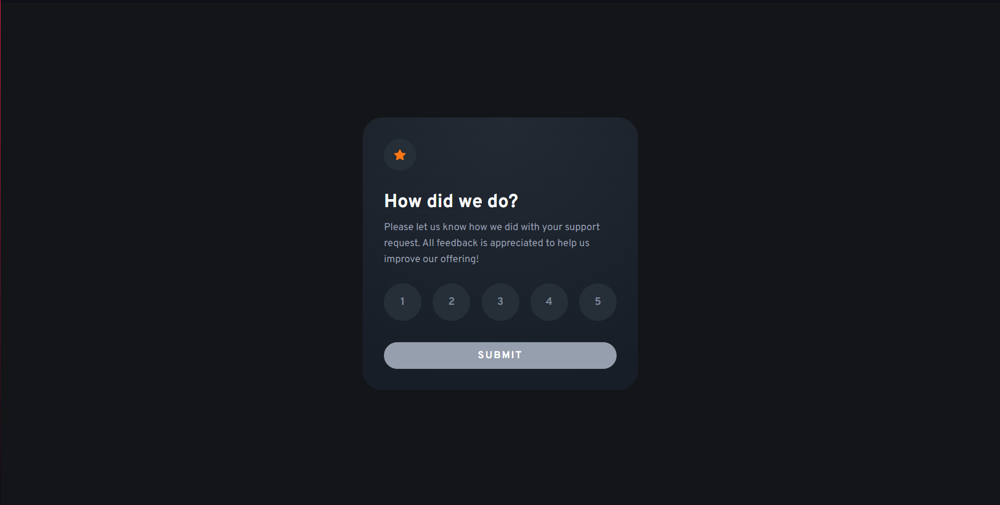

# Frontend Mentor - Interactive rating component solution

This is a solution to the [Interactive rating component challenge on Frontend Mentor](https://www.frontendmentor.io/challenges/interactive-rating-component-koxpeBUmI). Frontend Mentor challenges help you improve your coding skills by building realistic projects. 

## Table of contents

- [Overview](#overview)
  - [The challenge](#the-challenge)
  - [Screenshot](#screenshot)
  - [Links](#links)
- [My process](#my-process)
  - [Built with](#built-with)
  - [What I learned](#what-i-learned)
  - [Continued development](#continued-development)
  - [Useful resources](#useful-resources)
- [Author](#author)

**Note: Delete this note and update the table of contents based on what sections you keep.**

## Overview

### The challenge

Users should be able to:

- View the optimal layout for the app depending on their device's screen size
- See hover states for all interactive elements on the page
- Select and submit a number rating
- See the "Thank you" card state after submitting a rating

### Screenshot




### Links

- Solution URL: [https://github.com/SgtGarro/interactive-rating](https://github.com/SgtGarro/interactive-rating)
- Live Site URL: [https://sgtgarro.github.io/interactive-rating/](https://sgtgarro.github.io/interactive-rating/)

## My process

### Built with

- Semantic HTML5 markup
- CSS custom properties
- CSS Grid
- Tailwind (CSS Framework)
- Mobile-first workflow

### What I learned

Compared to other frameworks such as BootStrap, Tailwind is a framework that allows us to customize our styles that we want to use for our project, apart from the fact that it is based on the basics of utility first. 
That is, stop writing classes that we will possibly use only once like
```html
<div class="shopping-cart"></div>
<div class="article-news-container"></div>
```
And start using the classes for more general purposes, like
```html
<div class="py-5"></div> <!-- add vertical padding -->
<div class="mx-6"></div> <!-- add horizontal margin -->
```

### Continued development
To tell the truth, I still don't have much experience regarding CSS frameworks, CSS animations and DOM handling in depth, so it might not be the most tunable code but that's what these challenges are about, improving.

### Useful resources

- [Tailwind Documentation](https://tailwindcss.com/docs/utility-first) - This helped me a lot to get started and use all the tools that provides Tailwind.

## Author
- GitHub - [@SgtGarro](https://github.com/SgtGarro)
- Frontend Mentor - [@SgtGarro](https://www.frontendmentor.io/profile/SgtGarro)
